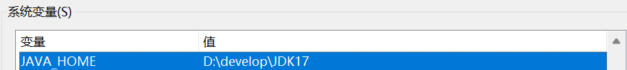
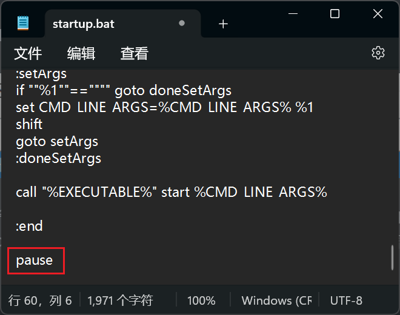
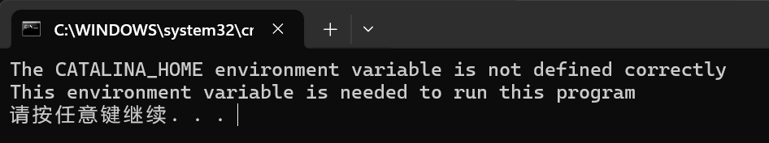
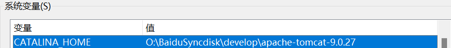
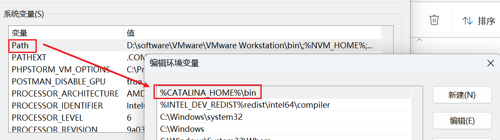
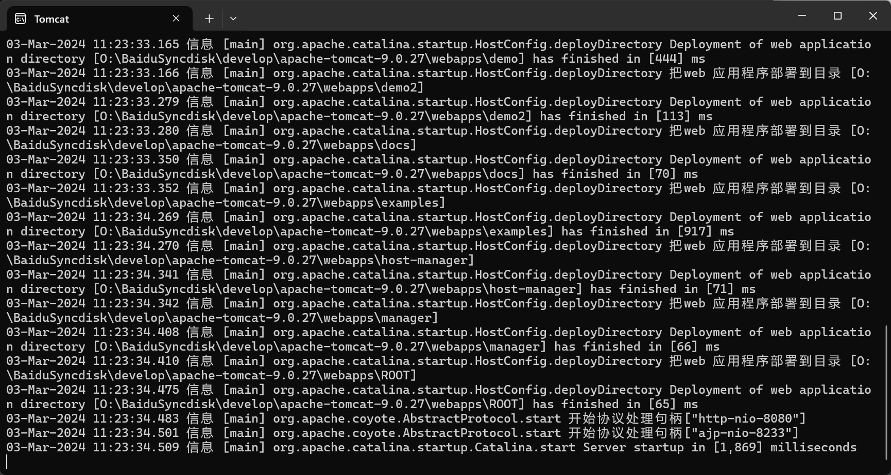
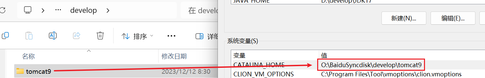
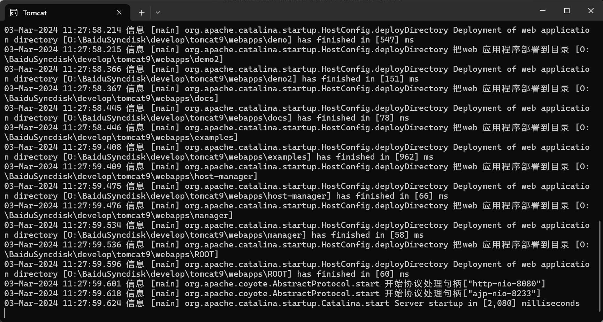

【Tomcat】The CATALINA_HOME environment variable is not defined correctly

@[TOC]

# 一、问题

运行绿色版Tomcat时，单击apache-tomcat-9.0.27\bin\startup.bat时窗口一闪而过。

检查JAVA_HOME环境变量，可以发现并没有问题。

为了检查错误，将startup.bat程序使用文本编辑器打开，在最后一行加上pause，保存后重新运行startup.bat，这时候窗口会留在桌面上（调试成功，把pause去掉即可），此时我们可以在DOS窗口看见错误信息。

报错：

---

# 二、解决办法

修改环境变量后

再次运行 startup.bat 

发现可以成功运行了

最后再删除掉 startup.bat 最后的pause即可

---

# 三、优化

以后下载文件，如果文件名太长，可以重命名为一个简短的文件名，比如这里我的文件名就命名为tomcat9

同时修改环境变量所对应的目录，path里的不用修改

重新点击 startup.bat ，同样也是可以成功运行的！

