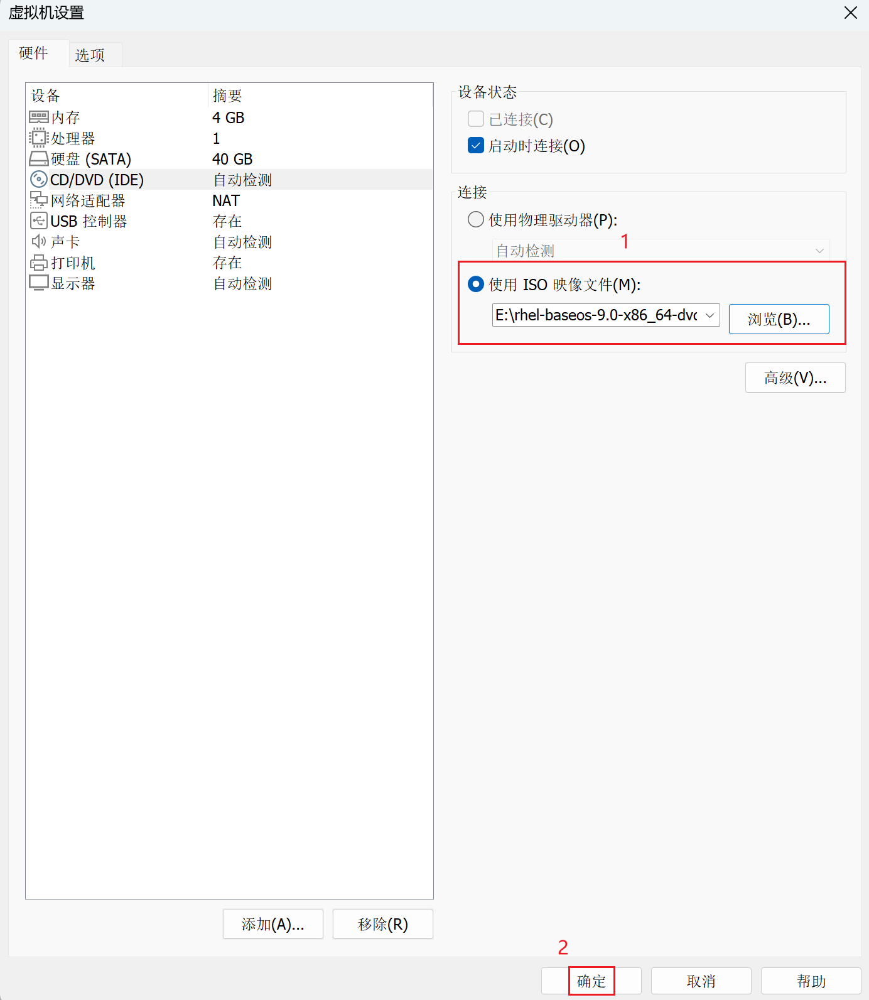

安装Linux环境

# 一、安装VMware

打开官网：[Download VMware Workstation Pro](https://www.vmware.com/products/workstation-pro/workstation-pro-evaluation.html)

安装步骤如下：

这⾥更改安装⽬录，选择安装到D盘

关闭⾃动更新和客户体验计划

快捷⽅式放桌⾯

开始安装

等待安装结束

**许可证秘钥**

许可证密钥：仅⽤作个⼈学习，请勿⽤作商业⽤途

ZF3R0-FHED2-M80TY-8QYGC-NPKYF

YF390-0HF8P-M81RQ-2DXQE-M2UT6

ZF71R-DMX85-08DQY-8YMNC-PPHV8

FA1M0-89YE3-081TQ-AFNX9-NKUC0

**激活成功界⾯**

注意：在安装虚拟机之前需要先确认虚拟化功能是否已经打开，不同 电脑的开启⽅式不⼀样，这个需要⼤家根据⾃⼰对应品牌的笔记本到 ⽹上搜⼀下：如何开启虚拟化

通过下⾯这些步骤确认是否开启了虚拟化功能。

在任务栏上点击右键--任务管理器--性能--CPU，如下图

确保以及开启虚拟化、如果没有请⾃⾏百度各类电脑开启虚拟化教 程，这⾥不赘述

# 二、新建虚拟机

选择新建

选择⾃定义⾼级

下⼀步

选择镜像⽂件与稍后安装

选择自己的操作系统，我这里以安装红帽操作系统举例

选择位置并给虚拟机命名

内核总数固定

指定虚拟机内存 4GB以上

使⽤⽹卡地址转换，对后续做静态IP配置做准备

I/O类型，磁盘类型默认

创建新的虚拟盘

最⼤允许使⽤的磁盘空间：建议40GB、拆分多个⽂件

新建

完成展示

选择这⾥

使⽤ISO镜像⽂件

开启虚拟机

在启动的虚拟机中点击⿏标，使⽤键盘上键选择第⼀项，安装操作系 统，然后按回⻋即可继续进⾏。

如果想将⿏标从虚拟机中移出来，请同时按住Ctrl+Alt

键盘上键选择install（注意，这⾥默认是第⼆个）

语⾔选择英文

确保时区是上海

选择安装位置、选择完成即可

修改⽹络配置

打开⾃动获取IP

