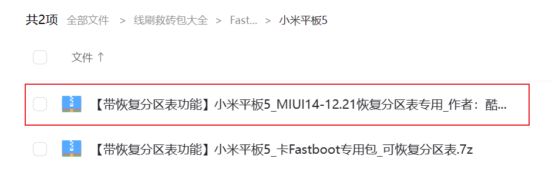

# 一、解锁

装Windows前需要解锁 `Bootloader锁`，这个需要保证下面第一步中，绑定账号和设备超过 `7天` 才能解锁。

下载解锁工具包：https://www.miui.com/unlock/download.html

下载好后进行解压，然后打开里面的 `miflash_unlock.exe`

解锁前需要做好备份，解锁会清除掉平板所有数据。

----

# 二、下载安卓资源包

解锁完成后，到 https://mindows.cn/ 下载 `Mindows V8工具箱`

下载 `脚本班 V8`

下载完是一个压缩包，将它解压缩

解压缩后运行 `Mindows工具箱.exe`

打开工具箱后点击左侧的设置图标，然后点击 `切换当前机型`。

然后在弹出的终端窗口中输入小米平板5的序号 `14`，然后按回车键。此时工具箱就在自动下载有关小米平板5的资源。

下载完成后窗口自动关闭，此时左下角就会显示型号了。

点击工具箱左侧的资源链接 ——> Mindows资源网盘

点击 `线刷救砖包大全`

点击 `Fastboot线刷包`

点击 `小米平板5`

点击 `【带恢复分区表功能】小米平板5_MIUI14-12.21恢复分区表专用_作者：酷安_曾小理.zip`

---

# 三、将平板进入 `fastboot模式`

无论是在开机、关机、死机状态下都可以进入 `fastboot模式`。

同时按住 `电源键和音量减键` ，直至出现小米logo。松开 `电源键` 并保持按住 `音量减键` ，直至出现 `fastboot` 提示，松开 `音量减键` ，就进入了 `fastboot模式`。

然后将平板连接电脑，打开刚刚下载的刷机包，将刷机包进行解压。

解压后运行 `一键刷入.bat`。

就会自动刷机，整个刷机过程大概耗时 `7分钟多`。这个包刷入的是 `miui14 12.21的开发版系统`。

如果你想删除掉 `Windows` 恢复到安卓系统，就可以用这个包刷，刷完后你的分区都会恢复，刷完窗口会自动关闭，平板也会自动重启。

> 如果在刷Windows过程中那步操作错误，遇到什么无法进系统、分区空间不满意想重新来一遍等等一系列问题......都可以使用这个包。将平板刷回到安卓状态，重头开始折腾。

----

# 四、将开发板切换为正式版

装好的救砖包是开发版，可以切换到正式版。

点击下图位置

然后点击上面的三个点

再点击 `切换为正式版`

点击 `去备份数据`

点击 `立即切换版本`

再点击确定后，会开始下载数据并更新。

更新完后提示重启。

就会提示会清除所有数据，点击确定即可。

重启完成后就会是最新的正式版系统了。

接下来就可以正式刷Windows了。

-----

# 五、下载Windows系统文件包

打开 `Mindows工具箱`，选择左侧的资源链接 ——> 点击 `Mindows资源网盘`

在网盘内有很多 `Windows系统` 刷机包可以选择，下载一个你想用的Windwos系统文件包即可。

----

# 六、下载 / 更新资源

点击 `下载 / 更新资源`，2 和 3 建议都下载一下

----

# 七、开启刷Windows

首先要打开开发者模式，然后在开发者模式中打开 `USB调试`

然后点击  `Mindows工具箱`，选择 `一键安装Windows`

按任意键继续。

然后再按任意键继续

然后按提示进入 `Fastboot模式`。

接下来工具箱会自动运行直至提示设置分区大小，这里按照自己的需求调整分区大小，觉得不合适刷一遍救砖包重新再来一遍就可以了。

设置完分区大小后点 `完成`。

在弹出的对话框选择 `确定`

接下来工具箱会自动运行分区，直至提示选择Windows系统包，这里选择你要刷的Windows系统文件

如果是懒人包，会有以下提示，输入 1 即可

接下来工具箱会自动运行直至Windows安卓完成。

在选择不同的Windows系统包时会有所差异。如果选择Windows原版系统安装包，会有下面显示的这幅图的设置，照此图设置即可。

但是由于这次刷机用的是懒人包，就不会有这个设置界面。

接下来的Windows系统，懒人包会直接进入系统，原版Windows会有一个新系统设置过程，安装完成后关闭一键安装Windows的窗口

耐心等待平板开机进入Windows系统即可。

进入Window系统后，在C盘根目录会有一个 `MindowsWOA工具包`，是个zip压缩文件，解压缩或者将里面的Mindows一键切换拷贝出来。

然后点击 `MindowsWOA工具包` 中的 `打不开先安装我`，然后点击 `Mindows一键切换`。

平板会重启，会出现无法正常进入安卓系统的情况。

首先大家要明白运行Mindows一键切换实际就是在输入安卓的Boot，现在进不去安卓系统的原因就出现在这个boot文件上。

现在平板内的安卓系统和Windows都是没有问题的，所以我们现在就需要解决这个boot文件的问题。

