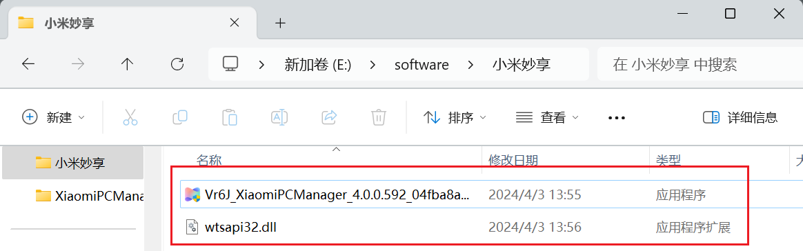
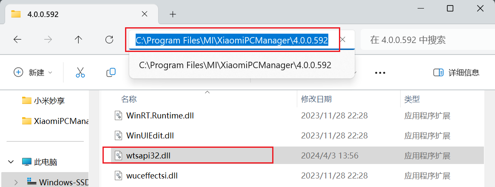

由于 `小米电脑管家` 现在新增了机型验证，本篇将分享非小米电脑用户如何绕过机型验证安装 `小米电脑管家` 

首先到小米跨端智联官网 https://hyperos.mi.com/continuity   中下载小米电脑管家

 打开官网链接后，直接滑动到底部，点击下载

下载完成后，先别急着安装，此时需要下载一个补丁 `wtsapi32.dll`，帮助我们跳过机型验证：下载百度网盘链接: https://pan.baidu.com/s/1nMpaJEnbc9iUmmTKyedxAQ 提取码: tsyh 

小米电脑软件安装包和补丁都下载好后，将它们放在同一个文件夹！！！这个很重要！！！

这个时候就可以直接点击安装包进行安装，安装完成后，同样先别着急打开小米电脑管家。

此时需要将刚刚下载好的  `wtsapi32.dll` 补丁复制粘贴到 `C:\Program Files\MI\XiaomiPCManager\4.0.0.592` 文件夹下

如果之前已经打开了小米电脑管家，操作完记得重启！！！重启完毕后就可以正常使用里面的功能了。